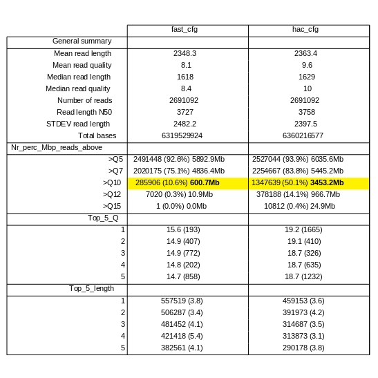
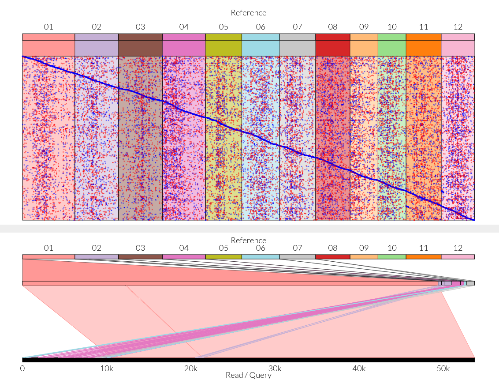
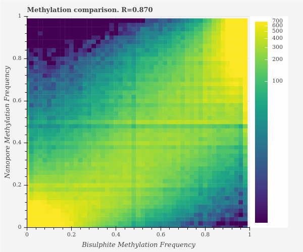
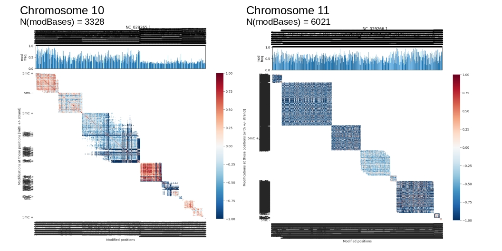

<br><br><br><br>

**Abstract**

>LTR retrotransposons (LTR-RTs) are mobile genetic elements constituting remarkable
portions of plant genomes and significantly contribute to genome structure, size and regulations.
Some LTR-RTs lineages are distributed uniformly while others are localized in centromeres of
monocentric chromosomes. But little is known about characterization and distribution of
retrotransposons within genomes with holocentric chromosomes. We will test our hypothesis that
the LTR RTs in holocentrics will be evenly distributed along chromosomes. Therefore we designed the
comparative study with three groups where each is composed from two holocentric plant species
with different karyotypes and one phylogenetically closest monocentric relative. These species will
be sequenced using: (1) Oxford Nanopore Technologies (long reads) and (2) Illumina sequencing
(short reads). The primary assembly will be generated and subjected to the in-depth LTR-RTs
detection analysis. Our investigation will provide information on LTR-RTs families abundance and
distribution in relation to the phenomenon of holocentrism.

<br/><br/>

**Project workflow**

>1. Plant species selection:
Holocentric plant species are chosen across phylogenetically distant taxons and concurrently
within one taxon/genera pick up at least two species with remarkably different karyotype.
Each higher holocentric taxon will be chosen its phylogenetically closest monocentric
counterparts. Representatives of monocots and eudicots will be included (for plant species
list see Table 1).
2. Genomic DNA sequencing:
We will obtain a partial and/or full-length sequences of LTR retrotransposons from all plant
species and a primary genome assembly of plant subset using combination of long (Oxford
Nanopore Technologies) and short (Illumina sequencing) reads.
3. Subsequent analysis:
o in-depth search and annotation of full-length LTR retrotransposons
o their distribution in chromosomes (alternatively in assembled scaffolds)
o identification of additional sequences carried within retroelements with possible
function for the holocentric arrangement – satellites, tandem repeats, retrogenes,
eORF, (micro) miRNA
4. Based on information about abundance of LTR retrotransposon families and their
distribution in our model plant species, we will describe LTR retrotransposon landscape and
its relation to holocentrism.

<br><br><br>

# Model species
 


<br>

## gDNA isolation
### NucleoSpin and Promega Wizard


<br><br>

### Viktor (**the best**) isolation
    ...
<br><br><br>

# NGS sequencing  

## ONT MinION long read sequencing

### Estimated genome coverage summary

```{r echo=FALSE}
coverage_tab <- read.table("Tables/short_long_reads_coverage.tsv", sep = "\t", header = TRUE)

# convert all NA to 0
coverage_tab[is.na(coverage_tab)] <- 0

# count genome coverage estimation
coverage_tab$coverage_estim <- round((((coverage_tab$illum_nr_reads*coverage_tab$illum_avg_readLen) + coverage_tab$ont_bp)/1000000)/(coverage_tab$genome_2C_Mbp/2),3)

# reorder columns
coverage_tab <- coverage_tab[,c(1,2,6,5,3,4)]
coverage_tab
```


<br>

### Sequencing progress

> Rapid Sequencing Kit (SQK-RAD004) was used for DNA library preparation of first five species
>
> gDNA was isolated using Promegas' Wizard® HMW DNA Extraction Kit (*C. acutiformis, E. uniglumis* and *L. elegans*) and/or using Viktor's phenol/chloroform based isolation protocol (*O. sativa* and *L. pilosa*)
>

<br>

{}

<br>


### Comparison of 'fast' and 'hac' (high accuracy) basecallings




<br>

### Read quality check

> The longest reads are in 'fastq_fail'
>
>> Check on reads from O. sativa run:


{width=60%}

<br>
<br>

{width=60%}

<br>
<br>

> Dividing fastq reads into qulity based bins:

```{python eval=FALSE, echo=FALSE}
#!/usr/bin/python3

from Bio import SeqIO

seq_sum = "sequencing_summary_FAO01582_6e7ae3e9.txt"

# bins = [4,5,7,9,12,15]

bins = [9,12,15]

def get_fq(read_list):
    fq_list = []
    fq_path = "allIn1Fq_file/allInOne.fastq"
    for rec in SeqIO.parse(fq_path, "fastq"):
        if rec.id in read_list:
            fq_list.append(rec)
    return fq_list

for i in range(len(bins)):
    read_header_list = []
    out_name = "Osat_reads_qlt_bin_{}_v2.fastq".format(str(bins[i]))
    fastq_list = []
    handle = open(out_name, "w")
    with open(seq_sum) as ss:
        next(ss)
        for l in ss:
            l_list = l.split("\t")
            fq_name = l_list[0]
            read_id = l_list[2]
            qlt = float(l_list[14])
            if i == 0:
                if qlt <= bins[i]:
                    read_header_list.append(read_id)                    
            else:
                if bins[i-1] < qlt <= bins[i]:
                    read_header_list.append(read_id)
    fastq_list = get_fq(read_header_list)
    SeqIO.write(fastq_list, handle, "fastq")
    handle.close()

```

<br>
<br>

{width=60%}

<br>
<br>

{width=60%}

<br>
<br>

> Mapping nanopore reads to O. sativa genome assembly (Osativa_323_v7.0.fa; [Ouyang et al., 2007](https://academic.oup.com/nar/article/35/suppl_1/D883/1116015)) using [**minimap2**](https://github.com/lh3/minimap2)
>
>  

```{bash eval=FALSE}
# creating index from ref:
minimap2 -x map-ont -d osat-ont.mmi Osat.fa

# input fq files:
head fqList.txt 
Osat_sub100kSeq_reads_qlt_bin_12_v2.fastq
Osat_sub100kSeq_reads_qlt_bin_15_v2.fastq
Osat_sub100kSeq_reads_qlt_bin_4_v2.fastq
Osat_sub100kSeq_reads_qlt_bin_5_v2.fastq
Osat_sub100kSeq_reads_qlt_bin_7_v2.fastq
Osat_sub100kSeq_reads_qlt_bin_9_v2.fastq

# running minimap2:
for f in $(cat fqList.txt); do n=$(echo $f | sed 's/.fastq//g') && minimap2 -ax map-ont osat-ont.mmi $f > $n'_mapped.sam'; done

# mapping stats in brief:
samtools flagstat Osat_sub100kSeq_reads_qlt_bin_5_v2_mapped.sam
4444 + 0 in total (QC-passed reads + QC-failed reads)
446 + 0 secondary
174 + 0 supplementary
0 + 0 duplicates
1660 + 0 mapped (37.35% : N/A)
0 + 0 paired in sequencing
0 + 0 read1
0 + 0 read2
0 + 0 properly paired (N/A : N/A)
0 + 0 with itself and mate mapped
0 + 0 singletons (N/A : N/A)
0 + 0 with mate mapped to a different chr
0 + 0 with mate mapped to a different chr (mapQ>=5)

```

<br>

{width=60%}

<br>
<br>

{width=100%}

<br>
<br>

> Running sliding windows for quality check through >100kbp long reads:
>

```{python eval=FALSE, echo=FALSE}

#!/usr/bin/python3

from Bio import SeqIO
import statistics
from pandas import DataFrame

fq = "../../Osat_reads_qlt_bin_4_v2.fastq"
       
out_list = []
over100k_cnt = 0
for r in SeqIO.parse(fq,"fastq"):
    if len(r.seq) >= 100000:
        over100k_cnt += 1
        window_cnt = 1
        phr_list = r.letter_annotations["phred_quality"]
        while phr_list:
            loopList = []
            if len(phr_list) >= 1000:
                out_list.append([r.id,window_cnt, statistics.median(phr_list[:1000]),
                                 statistics.mean(phr_list[:1000])])
                phr_list = phr_list[100:]
                window_cnt += 1
            else:
                out_list.append([r.id,window_cnt, statistics.median(phr_list),
                                 statistics.mean(phr_list)])
                phr_list = []

df = DataFrame(out_list, columns=['read_id','win_nr','median','mean'])
df.to_csv("Osat_allReadsBin4_slidinWin_1kbp_step100bp.csv", sep=',', index=False)
print("{} reads over 100kbp.".format(str(over100k_cnt)))


```


<br>

{width=130%}

<br>

> The extra long reads over 100kbp are exclusively in bin with Q up to 4. It means that nucleotide error probability is  **10^(-4/10)=0.398**.
>
> So far we do not have enough supporting arguments for using of long reads.


<br>

### Genome assembly
  
> Example of genome assembly, polishing, and scaffolding ([Choi et al., 2020](https://genomebiology.biomedcentral.com/articles/10.1186/s13059-020-1938-2): "Nanopore sequencing-based genome assembly and evolutionary genomics of **circum-basmati rice**")
>
>> <p>"After completion of sequencing, the raw signal intensity data was used for base calling using flip flop (version 2.3.5) from Oxford Nanopore Technologies. Reads with a mean qscore (quality) greater than 8 and a read length greater than 8 kb were used and trimmed for adaptor sequences using Porechop (https://github.com/rrwick/Porechop). Raw nanopore sequencing reads were corrected using the program Canu ([Koren et al., 2017](https://doi.org/10.1101%2Fgr.215087.116)) and then assembled with the genome assembler Flye ([Kolmogorov et al., 2019](https://www.nature.com/articles/s41587-019-0072-8))
>> <p>The initial draft assemblies were polished for three rounds using the raw nanopore reads with Racon ver. 1.2.1 ([Vaser et al., 2017](https://doi.org/10.1101%2Fgr.214270.116)) and one round with Medaka (https://github.com/nanoporetech/medaka) from Oxford Nanopore Technologies. Afterwards, reads from Illumina sequencing were used by bwa-mem ([Li 2013](https://arxiv.org/abs/1303.3997v2)) to align to the draft genome assemblies. The alignment files were then used by Pilon ver. 1.22 ([Walker et al, 2014](https://doi.org/10.1371%2Fjournal.pone.0112963)) for three rounds of polishing.</p>
>> <p>Contigs were scaffolded using a reference genome-guided scaffolding approach implemented in RaGOO ([Alonge et al., 2019](https://doi.org/10.1186%2Fs13059-019-1829-6)). Using the Nipponbare genome as a reference, we aligned the circum-basmati genomes using Minimap2 ([Li, 2018](https://doi.org/10.1093%2Fbioinformatics%2Fbty191)). RaGOO was then used to order the assembly contigs. Space between contigs was artificially filled in with 100 “N” blocks.</p>
>> <p>Genome assembly statistics were calculated using the bbmap stats.sh script from the BBTools suite (https://jgi.doe.gov/data-and-tools/bbtools/)."</p> 
<br>

#### Pipeline

```{r echo=FALSE}
library(DiagrammeR)
library(DiagrammeRsvg)
library(magrittr)
library(rsvg)

graph <-
  "digraph dot {
  
  graph [layout = dot, fontsize = 5]
  
  node [shape = box,
        style = filled,
        color = black,
        label = '']
  
  node [fillcolor = white]
  a[label = 'minion_pass_reads.fastq.gz']
  aa[label = 'adapter trimming \n Porechop']
  
  node [fillcolor = white]
  b[label = 'NanoFilt \n l_500, q >= 7, headCrop = 75'] 
  c[label = 'canu \n -correct'] 
  d[label = 'corrected_reads.fasta']
  
  node [fillcolor = white]
  
  edge [color = black]
  a -> aa -> b -> c -> d
  d -> {e[label = 'canu \n -assemble';color=blue] 
    f[label = 'flye';color=green]
    g[label ='raven';color=yellow]
    h[label = 'wtdbg2 \n (redbean)';color=red]}
  {e f g h} -> {i[label = 'Polishing I. \n raw ONT reads \n [3 rounds Racon; 1 round Medaka]']}
  i -> {j[label = 'Illumina reads aligning \n [bwa-mem]']} 
  j -> {k[label = 'Polishing II. \n alignments used 3 in rounds \n [Pilon]']}
}"

# grViz(graph)

# grViz(graph) %>%
#   export_svg %>% charToRaw %>% rsvg_pdf("graph.pdf")
# grViz(graph) %>%
#   export_svg %>% charToRaw %>% rsvg_png("graph.png", width = 700, height = 1800)
grViz(graph) %>%
  export_svg %>% charToRaw %>% rsvg_png("Images/assemblyPipeline.png")
# grViz(graph) %>%
#   export_svg %>% charToRaw %>% rsvg_svg("graph.svg")


# grviz


```


<br><br>

#### Read preparation, filtering and primary assembly

> Script
>
>> `nano_fq_chop_filt_assembly.sh`

```{bash eval=FALSE}
#!/bin/bash

# get raw fq list
ls fastq_pass/FAO*fastq > fq_list.txt

# adapter trimming using porechop
mkdir 1_adaptor_trimming_porechop
for fq in $(cat fq_list.txt)
do
	n=$(echo $fq | cut -f 2 -d "/" | sed 's/.fastq/_chopped.fastq/g') 
	porechop -i $fq -o '1_adaptor_trimming_porechop/'$n
done

# gzip chopped fqs
cd 1_adaptor_trimming_porechop
cat *_chopped.fastq >> allFastq.fastq
gzip -c allFastq.fastq > allFq_chopped.fastq.gz

# nanofilt
gunzip -c allFq_chopped.fastq.gz | NanoFilt -q 7 -l 500 --headcrop 75 | gzip > all_choppedReads_nfilt_q7_headCr_75_l500.fastq.gz
cd ..

# nanoQC stats
nanoQC -o 2_nanoQC_chopped_stats 1_adaptor_trimming_porechop/all_choppedReads_nfilt_q7_headCr_75_l500.fastq.gz

# canu corrected fqs [generates 'canuCorrect.correctedReads.fasta.gz']
mkdir 3_canu_correct
cd 3_canu_correct
cp ../1_adaptor_trimming_porechop/all_choppedReads_nfilt_q7_headCr_75_l500.fastq.gz .

canu -correct -p canuCorrect -d assembly genomeSize=10m -nanopore-raw all_choppedReads_nfilt_q7_headCr_75_l500.fastq.gz
cd ..

corrFa='3_canu_correct/canuCorrect.correctedReads.fasta.gz'

# run genome assembly using 4 different tools
# 1.
mkdir 4_flye_correctedReads_assembly
cp $corrFa 4_flye_correctedReads_assembly/.
cd 4_flye_correctedReads_assembly
flye --nano-raw canuCorrect.correctedReads.fasta.gz --out-dir flye_assembly_out --threads 6
cd ..

# 2.
mkdir 5_canu_correctedReads_assembly
cp $corrFa 5_canu_correctedReads_assembly/.
cd 5_canu_correctedReads_assembly
canu -p corrReads -d assembly_corrReads genomeSize=80m -nanopore-corrected canuCorrect.correctedReads.fasta.gz
cd ..

# 3. 
mkdir 6_raven_correctedReads_assembly
cp $corrFa 6_raven_correctedReads_assembly/.
cd 6_raven_correctedReads_assembly/.
raven canuCorrect.correctedReads.fasta.gz -t 6 > raven_corrReads_assembly.fasta
cd ..

# 4.
mkdir 7_redbean_wtdbg2_correctedReads_assembly
cp $corrFa 7_redbean_wtdbg2_correctedReads_assembly/.
cd 7_redbean_wtdbg2_correctedReads_assembly
~/Documents/Soft/wtdbg2/wtdbg2.pl -t 6 -x ont -g 100m -o wtdbg2 canuCorrect.correctedReads.fasta.gz
cd ..

printf "XXX FINISHED!!! XXX"

```
<br>

> Assembly using four different assemlers:


```{r echo=FALSE}
tab <- read.table("Tables/assembly_percTab.txt", sep="\t", header = T)
tab
```

<br><br>

#### Assemblers comparison - *O. sativa* reads

```{bash eval=FALSE, echo=FALSE}
for fa in $(cat fasta_list.txt); do n=$(echo $fa | sed 's/.fasta/_bbmap_stats_format3.tsv/g') && ~/Documents/Soft/bbmap/stats.sh in=$fa format=3 > $n; done
```

```{r echo=FALSE}
tab <- read.table("Tables/osat_assemblersComparison.tsv", sep = "\t", header = T)
tab$assemler[tab$assembler == "wtdbg"] <- "wtdbg2"
tab[,c(1,2,4,6:12)]

```
<br>

#### Flye genome assembly comparison with Os-Nipponbare-Reference-IRGSP-1.0

> [MUMmer](https://mummer4.github.io/): a system for rapidly aligning entire genomes

```{bash eval=FALSE}
~/Documents/Soft/mummer/nucmer -p nucmerAlign IRGSP-1.0_genome.fasta Osat_flye_assembly.fasta
~/Documents/Soft/mummer/dnadiff -d nucmerAlign.delta
~/Documents/Soft/mummer/mummerplot -l nucmerAlign.delta

# filter coordinates for Ribbon visualization
cat out.1coords | cut -f 1,2,3,4,5,6,7,8,9,12,13 > out_for_ribbon.1coords
cat out.mcoords | cut -f 1,2,3,4,5,6,7,8,9,12,13 > out_for_ribbon.mcoords

cat out.mcoords | cut -f 1,2,3,4,5,6,7,8,9,12,13 | head
1244	12042	10602	21384	10799	10783	95.93	43270923	53731	chr01	contig_4247
12145	44923	21384	53731	32779	32348	97.93	43270923	53731	chr01	contig_4247
27895	27978	58454	58537	84	84	100.00	43270923	169368	chr01	contig_1987
44125	46854	2665	1	2730	2665	90.39	43270923	139529	chr01	contig_3868
46353	54453	243025	250984	8101	7960	92.76	43270923	405317	chr01	contig_1301
50824	66551	51959	36442	15728	15518	97.01	43270923	51959	chr01	contig_4723
66383	66678	219651	219359	296	293	86.84	43270923	233972	chr01	contig_1596
67259	103694	35777	1	36436	35777	96.41	43270923	51959	chr01	contig_4723
98493	103348	37	4703	4856	4667	90.33	43270923	50883	chr01	contig_1903
118081	127998	82173	72748	9918	9426	88.06	43270923	146834	chr01	contig_1124
```
<br>


> Visualization in [Ribbon](https://www.biorxiv.org/content/biorxiv/suppl/2016/10/20/082123.DC1/082123-1.pdf)




<br><br>

### Repeats identification in nanopore reads

> **te-g-nester**
> 
>> te-g-nester performance on *O. sativa* genome and our test-assemblies:

```{r echo=FALSE}
tab <- read.table("Tables/osat_nester_performance_in_assemblies.tsv", sep = "\t", header = T)
tab

library(ggplot2)
ggplot(tab, aes(x=Mbp, y=all_Tes))+
  geom_point(aes(colour=osat_assembly), size=5, alpha=0.7)+
  theme_bw()

library(ggplot2)
ggplot(tab, aes(x=Mbp, y=annot._rate))+
  geom_point(aes(colour=osat_assembly), size=5, alpha=0.7)+
  theme_bw()
```

>> te-g-nester performance on test-assemblies from holocentric genomes:

```{r echo=FALSE}
tab <- read.table("Tables/nester_stats_in_holocentric_assemblies.tsv", sep = "\t", header = T)
tab$annot_rate <- round((tab$Tes_with_domain/tab$all_Tes)*100,2)
head(tab)


library(ggplot2)
ggplot(tab, aes(x=Mbp, y=all_Tes))+
  geom_point(aes(shape=species, colour=assembly), size=5, alpha=0.7)+
  theme_bw()

ggplot(tab, aes(x=Mbp, y=annot_rate))+
  geom_point(aes(shape=species, colour=assembly), size=5, alpha=0.7)+
  theme_bw()
```


<br>

> [**RepeatModeler**](https://www.pnas.org/content/117/17/9451) (v2.0.1) and RepeatMasker (v4.1.1) are run on all **Flye assembly fasta** sequences
> Metacentrum offer module with `repeatmodeler-1.0.11` version without specific LTR retrotransposon determination

{width=70%}


<br>

#### RepeatMasker is called immediatelly after RepeatModeler2

```{bash eval=FALSE}
#!/bin/bash

# input fasta
fa="canuCorrect.correctedReads.fasta"

# RepeatModeler - build DB
~/Documents/Soft/RepeatModeler-2.0.1/BuildDatabase -name db $fa

# RepeatModeler - run
nohup ~/Documents/Soft/RepeatModeler-2.0.1/RepeatModeler -database db -pa 8 -LTRStruct &> run.out

# Annotated species-specific repeat library
consFa=$(find -name "consensi.fa.classified")

# RepeatMasker - run
RepeatMasker -pa 8 -engine rmblast -gff -lib $consFa $fa
```

<br>

> Repetitive DNA detected using RepeatModeler-RepeatMasker in Flye assemblies of all species 

```{r echo=FALSE}
tab <- read.table("Tables/repModMask_summary_allSpec.tsv", sep = "\t", header = F)
colnames(tab) <- c("species","rep_group", "rep_subgroup","rep_length","assembly_length","rep_prop")
head(tab)
perc_vec <- c(8.25, 26.68, 23.26, 93.96, 40.41)

library(ggplot2)
ggplot(tab, aes(x=species, y=rep_prop, fill=rep_group)) +
  geom_bar(stat="identity") +
  ggtitle("Repetitive DNA detected in Flye assemblies of all species") +
  xlab("Plant species") +
  ylab("Repeat proportion [%]") + 
  labs(fill="Repeat group") +
  theme_bw() +
  theme(axis.text = element_text(size = 12)) +
  geom_text(x=1, y=10, label="8.3 %") +
  geom_text(x=2, y=30, label="26.7 %") +
  geom_text(x=3, y=28, label="23.3 %") +
  geom_text(x=4, y=75, label="94.0 %") +
  geom_text(x=5, y=35, label="40.4 %")

# LTR repeats
tab_retr <- subset(tab, tab$rep_group == "LTR" | tab$rep_group == "LINE")
ggplot(tab_retr, aes(x=species, y=rep_prop, fill=rep_subgroup)) +
  geom_bar(stat="identity") +
  ggtitle("Retrotransposons detected in Flye assemblies of all species") +
  xlab("Plant species") +
  ylab("Repeat proportion [%]") + 
  labs(fill="Repeat group") +
  theme_bw() +
  theme(axis.text = element_text(size = 12))

# DNA repeats
tab_dna <- subset(tab, tab$rep_group == "DNA")
ggplot(tab_dna, aes(x=species, y=rep_prop, fill=rep_subgroup)) +
  geom_bar(stat="identity") +
  ggtitle("DNA transposons detected in Flye assemblies of all species") +
  xlab("Plant species") +
  ylab("Repeat proportion [%]") + 
  labs(fill="Repeat group") +
  theme_bw() +
  theme(axis.text = element_text(size = 12))


```

### Prediction of TE-specific DNA modification using modPhred

#### modPhred ([Pryszcz & Novoa, 2021](https://www.biorxiv.org/content/10.1101/2021.03.26.437220v1))

> DNA or RNA modification probabilities information from basecalled FAST5 datasets
> strong correlation between in fast5 detected modification and bisulphite methylation from NGS sequencing
>
> Nanopore/Bisulphite methylation frequency correlation
> ([from Modified Base Tutorial](https://labs.epi2me.io/notebooks/Modified_Base_Tutorial.html))



<br>

#### modPhred pipeline:
>
> **guppy_basecaller** on 'fast5_pass' data using `dna_r9.4.1_450bps_modbases_dam-dcm-cpg_hac.cfg`
> **modPhred** 
>  `~/src/modPhred/run -f ref/Os-Nipponbare-Reference-IRGSP-1.0_GCF_001433935.1.fna -o modPhred/ -i workspace/ -t6`
>  `~/src/modPhred/src/mod_plot.py --scatter -i modPhred/mod.gz`
>  `~/src/modPhred/src/mod_correlation.py -i modPhred/mod.gz`

{width=70%}

<br>

#### Run guppy_basecaller on Metacentum
> My storage path and address for scp:

```{bash eval=FALSE}
pavel@astat:/mnt/hdd_4TB/MinION_outputs/Osat_1/CTAB_Viktor_1/20200917_0715_MN34570_FAO01582_9d0828e0$ scp osat_fast5_pass.tar.gz storage-du-cesnet.metacentrum.cz:/tape_tape/archive/VO_metacentrum/home/pj_narutro/modPhred/osat_modPhred/.
pavel@debian-10-buster:~$ ssh pj_narutro@radegast.ueb.cas.cz
(BUSTER)pj_narutro@radegast:~$ cd /storage/du-cesnet/tape_tape/archive/VO_metacentrum/home/pj_narutro/modPhred/ecol_modPhred_test/
```

<br>

> Scratch job script:
>
>`scratchJob_guppyGpu_441_damDcmCpg_lpil.sh`

```{bash eval=FALSE, echo=FALSE}
#!/bin/bash
#PBS -N guppy_lpil
#PBS -l select=1:ncpus=8:ngpus=1:mem=12gb:scratch_local=10gb
#PBS -l walltime=24:00:00 
#PBS -m abe
# The 4 lines above are options for scheduling system: job will run 1 hour at maximum, 1 machine with 4 processors + 4gb RAM memory + 10gb scratch memory are requested, email notification will be sent when the job aborts (a) or ends (e)

# define a DATADIR variable: directory where the input files are taken from and where output will be copied to
DATADIR=/storage/du-cesnet/tape_tape/archive/VO_metacentrum/home/pj_narutro/modPhred/lpil_modPhred/ # substitute username and path to to your real username and path

# append a line to a file "jobs_info.txt" containing the ID of the job, the hostname of node it is run on and the path to a scratch directory
# this information helps to find a scratch directory in case the job fails and you need to remove the scratch directory manually 
echo "$PBS_JOBID is running on node `hostname -f` in a scratch directory $SCRATCHDIR" >> $DATADIR/jobs_info.txt

#loads modul guppy:
module add guppy-4.4.1

# test if scratch directory is set
# if scratch directory is not set, issue error message and exit
test -n "$SCRATCHDIR" || { echo >&2 "Variable SCRATCHDIR is not set!"; exit 1; }

# copy input files to scratch directory
# if the copy operation fails, issue error message and exit
cp -r $DATADIR/lpil_fast5_pass.tar.gz $SCRATCHDIR || { echo >&2 "Error while copying input file(s)!"; exit 2; }

# move into scratch directory
cd $SCRATCHDIR 

# if the calculation ends with an error, issue error message an exit
# extract fast5
tar xzvf lpil_fast5_pass.tar.gz

# define input/output directories
d="fast5_pass"
d_out='lpil_'$d'_guppy_out'
mkdir $d_out

# call guppy_basecaller
guppy_basecaller --device cuda:0 -c dna_r9.4.1_450bps_modbases_dam-dcm-cpg_hac.cfg --compress_fastq --fast5_out --disable_pings -ri $d -s $d_out ||{ echo >&2 "guppy_baecaller crashed with a code $?"; exit 3; }

# move the output to user's DATADIR or exit in case of failure
cp -r $d_out $DATADIR/ || { echo >&2 "Result file(s) copying failed (with a code $?) !!"; exit 4; }

# clean the SCRATCH directory
clean_scratch
```

<br>

> Run a scratch job:

```{bash eval=FALSE}
(BUSTER)pj_narutro@radegast:~$ qsub -q gpu -l select=1:ncpus=8:ngpus=1:mem=12gb:scratch_local=10gb scratchJob_guppyGpu_441_damDcmCpg_lpil.sh
```
<br>

#### modPhred run on astat

> Reference fasta:
>
> + publicly available genome assembly
> + *de novo* assembly
> + chromosome or its part specified by start-end positions
> + nanopore canu-corrected reads
>
> `~/src/modPhred/run -f ref/Os-Nipponbare-Reference-IRGSP-1.0_GCF_001433935.1.fna -o modPhred/ -i workspace/ -t6`
> `~/src/modPhred/src/mod_plot.py --scatter -i modPhred/mod.gz`
> `~/src/modPhred/src/mod_correlation.py -i modPhred/mod.gz`

> outputs

~~~
$ tree modPhred/
modPhred/
├── correlations
│   ├── NC_029256.1.csv.gz
│   ├── NC_029256.1.csv.gz.svg
│   ├── NC_029257.1.csv.gz
│   ├── NC_029257.1.csv.gz.svg
│   ├── NC_029258.1.csv.gz
│   ├── NC_029258.1.csv.gz.svg
│   ├── NC_029259.1.csv.gz
│   ├── NC_029259.1.csv.gz.svg
│   ├── NC_029260.1.csv.gz
│   ├── NC_029260.1.csv.gz.svg
│   ├── NC_029263.1.csv.gz
│   └── NC_029263.1.csv.gz.svg
├── minimap2
│   ├── workspace.bam
│   ├── workspace.bam.bai
│   ├── workspace.bam.bed
│   └── workspace.log
├── mod.bed
├── mod.gz
├── mod.gz.svg
├── modPhred.pkl
├── osatModPhred_igv_snapshot1.png
├── osatModPhred_igv_snapshot2.png
├── osatModPhred_igv_snapshot3.png
└── plots
    ├── basecall_accuracy.svg
    ├── depth.svg
    ├── median_mod_prob.svg
    └── mod_frequency.svg

3 directories, 27 files

###

$ head mod.bed 
NC_029256.1	2828345	2828346	5mC	967	+	2828345	2828346	0,0,151	27	59
NC_029256.1	2828401	2828402	5mC	850	+	2828401	2828402	0,0,59	26	23
NC_029256.1	2828464	2828465	5mC	967	+	2828464	2828465	0,0,186	26	73
NC_029256.1	2828494	2828495	5mC	817	+	2828494	2828495	0,0,41	25	16
NC_029256.1	2828590	2828591	5mC	1000	+	2828590	2828591	0,0,128	28	50
NC_029256.1	2828597	2828598	5mC	583	+	2828597	2828598	0,0,39	26	15
NC_029256.1	2828626	2828627	5mC	1000	+	2828626	2828627	0,0,235	25	92
NC_029256.1	2828633	2828634	5mC	800	+	2828633	2828634	0,0,104	27	41
NC_029256.1	2828637	2828638	5mC	833	+	2828637	2828638	0,0,143	25	56
NC_029256.1	2828652	2828653	5mC	800	+	2828652	2828653	0,0,61	25	24

$ cut -f 4 mod.bed | sort | uniq -c
  38873 5mC
    385 6mA
~~~
<br>

> Mapping coverage of *O. sativa* genome `Nipponbare IRGSP-1.0; GCF_001433935.1` using **minimap2**

```{r echo=FALSE}
tab <- read.table("Tables/modPhred_osat_mappCoverage_final.tsv", sep = "\t", header = T)
tab
```

<br>

> QC plots


<br>

> IGV visualization
>
>> *O. sativa*: NC_029266.1 Chromosome 11 Reference IRGSP-1.0


<br>

>> *O. sativa*: NC_029266.1 Chromosome 11 Reference IRGSP-1.0 (zoom in)


<br>

> Modifications in co-ocurrence heatmap

{width=130%; heigth=130%}

> Comparison of nanopore predicted dna methylations with Illumina data from bisulfite conversion
>
>> Bisulfite NGS data processing using [Bismark tool](https://github.com/FelixKrueger/Bismark)
>>
>> I have obtained over 5M uniq methylated bases accross *O. sativa* genome (n=5114321; CpG, CHG, CHH)
>> modPhred detected 38873 (5mC) + 385 (6mA) = 39258; i.e. ~ 130.3x lower detection. 

```{bash eval=FALSE}
# SRAfile download and extraction
$ wget https://sra-download.ncbi.nlm.nih.gov/traces/sra44/SRR/012798/SRR13105618
$ ~/Documents/Soft/sratoolkit.2.4.1-ubuntu64/bin/fastq-dump --split-files SRR13105618

# fastq files subsetting
$ seqtk sample -s100 SRR13105618_1.fastq 1000000 > SRR13105618_1M_subset_1.fastq
$ seqtk sample -s100 SRR13105618_2.fastq 1000000 > SRR13105618_1M_subset_2.fastq

# run Bismark perl script
$ ~/Documents/Soft/Bismark/bismark_genome_preparation --path_to_aligner /usr/bin/ --verbose ref/

$ ~/Documents/Soft/Bismark/bismark --parallel 4 --genome ref/ -1 SRR13105618_1M_subset_1.fastq -2 SRR13105618_1M_subset_2.fastq 

$ ~/Documents/Soft/Bismark/deduplicate_bismark --bam SRR13105618_1M_subset_1_bismark_bt2_pe.bam

$ ~/Documents/Soft/Bismark/bismark_methylation_extractor --gzip --bedGraph SRR13105618_1M_subset_1_bismark_bt2_pe.deduplicated.bam

$ ~/Documents/Soft/Bismark/bismark2report

$ tree bismark_methylation_extractor_outputs/
bismark_methylation_extractor_outputs/
├── CHG_OB_SRR13105618_1M_subset_1_bismark_bt2_pe.deduplicated.txt
├── CHG_OT_SRR13105618_1M_subset_1_bismark_bt2_pe.deduplicated.txt
├── CHH_OB_SRR13105618_1M_subset_1_bismark_bt2_pe.deduplicated.txt
├── CHH_OT_SRR13105618_1M_subset_1_bismark_bt2_pe.deduplicated.txt
├── CpG_OB_SRR13105618_1M_subset_1_bismark_bt2_pe.deduplicated.txt
├── CpG_OT_SRR13105618_1M_subset_1_bismark_bt2_pe.deduplicated.txt
├── extrList.txt
├── osat_bisulfite_methBases_forR.tsv
└── osat_bisulfite_methBases_subsetDiv250_forR.tsv

$ head bismark_methylation_extractor_outputs/CHG_OB_SRR13105618_1M_subset_1_bismark_bt2_pe.deduplicated.txt
Bismark methylation extractor version v0.23.0
SRR13105618.93013374_93013374_length=150	+	NC_029260.1	11570272	X
SRR13105618.93013374_93013374_length=150	+	NC_029260.1	11570265	X
SRR13105618.93013374_93013374_length=150	-	NC_029260.1	11570250	x
SRR13105618.93013374_93013374_length=150	-	NC_029260.1	11570247	x
SRR13105618.93013374_93013374_length=150	+	NC_029260.1	11570234	X
SRR13105618.93013374_93013374_length=150	+	NC_029260.1	11570219	X
SRR13105618.93013374_93013374_length=150	+	NC_029260.1	11570213	X
SRR13105618.93013374_93013374_length=150	-	NC_029260.1	11570210	x
SRR13105618.93013374_93013374_length=150	-	NC_029260.1	11570191	x

$ for f in $(cat extrList.txt); do pref=$(echo $f |cut -f 1 -d 'S'| cut -f 1,2 -d "_") && grep -v "Bismark\|NW" $f | grep -P "\t[HXZ]" | cut -f 3,4 | sort | uniq | sed -r "s/$/\t$pref\tbisulfite/g"; done >> osat_bisulfite_methBases_forR.tsv

$ head bismark_methylation_extractor_outputs/osat_bisulfite_methBases_forR.tsv 
NC_011033.1	212370	CHG_OB	bisulfite
NC_011033.1	213507	CHG_OB	bisulfite
NC_011033.1	228292	CHG_OB	bisulfite
NC_011033.1	228410	CHG_OB	bisulfite
NC_011033.1	240374	CHG_OB	bisulfite
NC_011033.1	240381	CHG_OB	bisulfite
NC_011033.1	240424	CHG_OB	bisulfite
NC_011033.1	240440	CHG_OB	bisulfite
NC_011033.1	240450	CHG_OB	bisulfite
NC_011033.1	240463	CHG_OB	bisulfite

$ wc -l bismark_methylation_extractor_outputs/osat_bisulfite_methBases_forR.tsv 
5114321 bismark_methylation_extractor_outputs/osat_bisulfite_methBases_forR.tsv

$ python3 modPhre_bisulfite_intersects.py mod.bed osat_bisulfite_methBases_forR.tsv 
mp_cnt_tot	39258
mp_cnt_match	7009
mp_not_in_bs	277
```
<br>

```{r echo=FALSE}
#  load table
tab <- read.table("Tables/Osat_bisulfite_modPred_copmTab.tsv",sep = "\t", header = T)
knitr::kable(
  list(tab),
  caption = 'Bisulfite sequencing (CpG, CHG, CHH) versus ONT (5mC) + modPred methylation detection in O. sativa.',
  valign = 't'
)

# melt tab using reshape
library(reshape2)
tab_resh <- melt(tab[,c(1,5:7)], id=c("chromosome"))

# plot
library(ggplot2)
ggplot(tab_resh, aes(x=chromosome, y=value, fill = variable)) +
  geom_bar(stat="identity", position=position_dodge()) +
  ggtitle("Proportion of DNA modification in O. sativa compared with chromosome length", subtitle = "ONT (modPhred) versus bisulfite conversion") +
  xlab("Chromosome ID") +
  ylab("Proportion of DNA modification or chr. length [%]") +
  labs(fill = "") +
  theme_bw() +
  theme(axis.text = element_text(size = 10),
          axis.text.x = element_text(angle=90,size=10))
```
<br><br>

### Comparison of DNA modification in repeats of holo/monocentric plant genomes

#### te-g-nester outputs and modPhred predictions

```{bash echo=FALSE, eval=FALSE}
$ python3 mod_in_repeatDNA.py osat_mod.bed osat_allNesterGFF.gff 
Tot mod count: 555956
Mod in TEs: 171118 (30.78 %)
Mods out of TEs: 384838 (69.22 %)


osat	1990	372	555956	171118

$ python3 ../mod_in_repeatDNA.py lele_mod.bed lele_allNesterGFF.gff 
Tot mod count: 91300
Mod in TEs: 9268 (10.15 %)
Mods out of TEs: 82032 (89.85 %)


lele	17	14	91300	9268

$ python3 ../mod_in_repeatDNA.py lpil_mod.bed lpil_allNesterGFF.gff 
Tot mod count: 27741
Mod in TEs: 5368 (19.35 %)
Mods out of TEs: 22373 (80.65 %)


lpil	19	14	27741	5368

$ python3 ../mod_in_repeatDNA.py cacu_mod.bed cacu_allNesterGFF.gff 
Tot mod count: 48680
Mod in TEs: 7970 (16.37 %)
Mods out of TEs: 40710 (83.63 %)


cacu	36	27	48680	7970

$ python3 ../mod_in_repeatDNA.py euniste_mod.bed euniste_allNesterGFF.gff 
Tot mod count: 132419
Mod in TEs: 28643 (21.63 %)
Mods out of TEs: 103776 (78.37 %)


euniste	31	25	132419	28643
```

```{r echo=FALSE}
tab <- read.table("Tables/nesterTEs_modPhredMod_summary.tsv", sep = "\t", header = TRUE)
tab$mod_tes_perc <- round((tab$mod_tes/tab$tes_tot)*100, 2)
tab$mod_in_tes_perc <- round((tab$mods_in_tes/tab$mods_tot)*100, 2)
tab

library(ggplot2)
ggplot(tab, aes(x=spec, y=mod_tes_perc, fill=spec)) +
  geom_bar(stat='identity') +
  ggtitle("Proportion of TEs with 5mC/6mA") +
  xlab("Plant species") +
  ylab("TEs with DNA modification [%]") + 
  labs(fill="Plant species") +
  theme_bw() +
  theme(axis.text = element_text(size = 12))

ggplot(tab, aes(x=spec, y=mod_in_tes_perc, fill=spec)) +
  geom_bar(stat='identity') +
  ggtitle("Proportion of all 5mC/6mA in TEs") +
  xlab("Plant species") +
  ylab("5mC/mA in TEs [%]") + 
  labs(fill="Plant species") +
  theme_bw() +
  theme(axis.text = element_text(size = 12))
```
> Methylated base positions within TEs

```{r echo=FALSE}
tab <- read.table("Tables/modsWithinTEs.tsv", sep = "\t", header = TRUE)
tab$ltr_perc <- round((tab$ltr/tab$mods_tot)*100, 2)
tab$ltr_ppt_pbs_perc <- round((tab$ltr_ppt_pbs/tab$mods_tot)*100, 2)
tab$gag_pol_perc <- 100 - tab$ltr_ppt_pbs_perc
tab

library(ggplot2)
# ggplot(tab, aes(x=spec, y=ltr_perc, fill=spec)) +
#   geom_bar(stat='identity') +
#   ggtitle("Proportion of 5mC/6mA marks in LTRs and their proximities") +
#   xlab("Plant species") +
#   ylab("5mC/mA marks [%]") + 
#   labs(fill="Plant species") +
#   theme_bw() +
#   theme(axis.text = element_text(size = 12))

# melt tab using reshape
library(reshape2)
tab_resh <- melt(tab[,c(1,6,7)], id=c("spec"))
tab_resh$variable <- factor(tab_resh$variable, levels = c("gag_pol_perc","ltr_ppt_pbs_perc"))

ggplot(tab_resh, aes(x=spec, y=value, fill=variable)) +
  geom_bar(stat='identity') +
  ggtitle("Proportion of 5mC/6mA marks in LTR+UTRs and GAG+POL") +
  xlab("Plant species") +
  ylab("5mC/mA marks [%]") + 
  labs(fill="Plant species") +
  theme_bw() +
  theme(axis.text = element_text(size = 12))
```

<br><br><br>

##  Illumina miSeq short read sequencing
<br>

### Genomic DNA samples

```{r echo=FALSE}
dna_tab <- read.table("Tables/MiSeq_2020/gDNA_contentsSummaryTable_July2020.csv", sep = ",", header = TRUE)
col_names <- c("label","custom_label","species","ng/ul","tot_volume_ul","tot_dna_ug","ul/ug_dna","volume_ul","custom_label")
colnames(dna_tab) <- col_names
dna_tab

```
<br>

### Run info

```{r echo=FALSE}
info_tab <- read.table("Tables/MiSeq_2020/INFO", sep = ";", header = TRUE)
col_names <- c("name", "sample_name", "dna/rna", "dna_type", "amplified",
               "lib_prep_kit","technology","seq_run_name","read_length","frag_size",
               "indexes","date_completion","note","date_removing","strips")
colnames(info_tab) <- col_names

info_tab

```
<br>

### MultiQC basic stats

> [Genome coverage](https://www.illumina.com/documents/products/technotes/technote_coverage_calculation.pdf)
>
>> Coverage Equation The Lander/Waterman equation is a method for computing coverage. 
>>
>> The general equation is:
>>
>> **C = LN / G**
>>
>> - C stands for coverage
>> - G is the *haploid genome* length
>> - L is the read length
>> - N is the number of reads
>>
>> So, if we take one lane of single read human sequence with v3 chemistry, we get C = (100 bp)*(189×106)/(3×109 bp) = 6.3
>> This tells us that each base in the genome will be sequenced between six and seven times on average.
<br>

```{r echo=FALSE}
multiQC_tab <- read.table("Tables/MiSeq_2020/multiqc_general_stats.txt", sep = "\t", header = TRUE)
col_names <- c("sample", "percent_duplicates","percent_gc","avg_seq_length","percent_fails","tot_sequences")
colnames(multiQC_tab) <- col_names
multiQC_tab$tot_Mbp_estim <- round((multiQC_tab$avg_seq_length*multiQC_tab$tot_sequences)/1000000, 3)
multiQC_tab$species <- c("Luzula pilosa", "Luzula pilosa", "Luzula elegans", "Luzula elegans", "Oryza sativa", "Oryza sativa", "Secale cereale", "Secale cereale", "Carex acutiformis", "Carex acutiformis", "Cyperus papyrus", "Cyperus papyrus", "Eleocharis uniglumis var. sternerii", "Eleocharis uniglumis var. sternerii", "Drosera capensis", "Drosera capensis", "Drosera filiformis var. tracyi", "Drosera filiformis var. tracyi", "Nepenthes ventricosa", "Nepenthes ventricosa", "Drosophyllum lusitanicum", "Drosophyllum lusitanicum", "Rumex acetosa", "Rumex acetosa", "Rumex alpinus", "Rumex alpinus", "Chamaelirium luteum", "Chamaelirium luteum", "Paris quadrifolia", "Paris quadrifolia","NA","NA")
multiQC_tab$genome_2C_Mbp <- c(588, 588, 8330, 8330, 799, 799, 7917, 7917, 800, 800, 542, 542, 238, 238, 789, 789, 5930, 5930, 3315, 3315, 20833, 20833, 6104, 6104, 868, 868, 1800, 1800, 99019, 99019, 0, 0)

multiQC_tab$genome_coverage <- round((((multiQC_tab$avg_seq_length/1000000)*multiQC_tab$tot_sequences)*2)/(multiQC_tab$genome_2C_Mbp/2),3)
multiQC_tab

```
<br>
...

<br><br>

# Repetitive DNA overview - RepeatExplorer 

Genomic DNA of all plant species were sequenced using Illumina miSeq. Load of gDNA were adjusted proportionally to their genome size.
<br><br>

## Run analysis on Galaxy server
[RepExp Galaxy server link](https://repeatexplorer-elixir.cerit-sc.cz/galaxy "RepExp Galaxy").

### Preprocessing of FASTQ paired-end reads

   * Sample size (number of pairs): 1000000
   * Trim reads 1 to 100 position
   * Rename reads
   
### RepeatExplorer2 clustering

   * Paired ends
   * No reads sampling
   * No comparative analysis
<br><br>

## RepExp outputs analysis
### Parsing CLUSTER_TABLE.csv outputs

```{python eval=FALSE, echo=FALSE}
#!/usr/bin/python3
import sys
import string
# run as: python3 parse_cluster_table.py Osat CLUSTER_TABLE.class

clust_tabs = sys.argv[1:]

# Annotation list:
annot_list = ["All", "All/organelle", "All/organelle/mitochondria", "All/organelle/plastid", "All/repeat", "All/repeat/mobile_element", "All/repeat/mobile_element/Class_II/Subclass_1/TIR/EnSpm_CACTA", "All/repeat/mobile_element/Class_II/Subclass_1/TIR/hAT", "All/repeat/mobile_element/Class_II/Subclass_1/TIR/MuDR_Mutator", "All/repeat/mobile_element/Class_II/Subclass_1/TIR/Tc1_Mariner", "All/repeat/mobile_element/Class_II/Subclass_2/Helitron", "All/repeat/mobile_element/Class_I/LINE", "All/repeat/mobile_element/Class_I/LTR", "All/repeat/mobile_element/Class_I/LTR/Ty1_copia", "All/repeat/mobile_element/Class_I/LTR/Ty1_copia/Ale", "All/repeat/mobile_element/Class_I/LTR/Ty1_copia/Alesia", "All/repeat/mobile_element/Class_I/LTR/Ty1_copia/Angela", "All/repeat/mobile_element/Class_I/LTR/Ty1_copia/Bianca", "All/repeat/mobile_element/Class_I/LTR/Ty1_copia/Ikeros", "All/repeat/mobile_element/Class_I/LTR/Ty1_copia/Ivana", "All/repeat/mobile_element/Class_I/LTR/Ty1_copia/SIRE", "All/repeat/mobile_element/Class_I/LTR/Ty1_copia/TAR", "All/repeat/mobile_element/Class_I/LTR/Ty1_copia/Tork", "All/repeat/mobile_element/Class_I/LTR/Ty3_gypsy/chromovirus/CRM", "All/repeat/mobile_element/Class_I/LTR/Ty3_gypsy/chromovirus/Galadriel", "All/repeat/mobile_element/Class_I/LTR/Ty3_gypsy/chromovirus/Reina", "All/repeat/mobile_element/Class_I/LTR/Ty3_gypsy/chromovirus/Tekay", "All/repeat/mobile_element/Class_I/LTR/Ty3_gypsy/non-chromovirus/OTA/Athila", "All/repeat/mobile_element/Class_I/LTR/Ty3_gypsy/non-chromovirus/OTA/Tat", "All/repeat/mobile_element/Class_I/LTR/Ty3_gypsy/non-chromovirus/OTA/Tat/Ogre", "All/repeat/mobile_element/Class_I/LTR/Ty3_gypsy/non-chromovirus/OTA/Tat/Retand", "All/repeat/mobile_element/Class_I/pararetrovirus", "All/repeat/rDNA/45S_rDNA", "All/repeat/rDNA/45S_rDNA/18S_rDNA", "All/repeat/rDNA/45S_rDNA/25S_rDNA", "All/repeat/rDNA/5S_rDNA", "All/repeat/satellite"]
spec_holomono_dict = {"Cacu":'holocentric', "Chlut":'holocentric', "Cpap":'holocentric', 
"Dcap":'holocentric', "Dfil":'holocentric', "Dlus":'monocentric', 
"Euni":'holocentric', "Lele":'holocentric', "Lpil":'holocentric', 
"Nven":'monocentric', "Osat":'monocentric', "Pqua":'monocentric', 
"Race":'monocentric', "Ralp":'monocentric', "Scer":'monocentric'}

def fill_dict(clust_tabs):
    in_dict = {}
    for csv in clust_tabs:
        spec = csv.split("_")[0]
        in_dict[spec] = {}
        with open (csv) as tab:
            for l in tab:
                line_list = l.rstrip().replace("\"","").split("\t")
                if "Number_of" in line_list[0]:
                    in_dict[spec][line_list[0]] = line_list[1]
                if str(line_list[0]).isdigit():
                    sup_clstr = line_list[1]
                    size = line_list[2]
                    aut_annot = line_list[4]
                    if sup_clstr not in in_dict[spec].keys():
                        in_dict[spec][sup_clstr] = {}
                        if aut_annot not in in_dict[spec][sup_clstr].keys():
                            in_dict[spec][sup_clstr][aut_annot] = []
                            in_dict[spec][sup_clstr][aut_annot].append(int(size))
                        else:
                            in_dict[spec][sup_clstr][aut_annot].append(int(size))
                    else:
                        if aut_annot not in in_dict[spec][sup_clstr].keys():
                            in_dict[spec][sup_clstr][aut_annot] = []
                            in_dict[spec][sup_clstr][aut_annot].append(int(size))
                        else:
                            in_dict[spec][sup_clstr][aut_annot].append(int(size))
    return in_dict
in_dict = fill_dict(clust_tabs)

def gen_out_tsv(in_dict):
    out_name= "holoMono_RepExp_all_spec_prop.tsv"
    with open(out_name, 'w') as out:
        for s in in_dict.keys():
            tot_reads_cnt = int(in_dict[s]['Number_of_analyzed_reads'])
            for an in annot_list:
                an_read_cnts = 0
                for sc in in_dict[s].keys():
                    if sc.isdigit():
                        if an in in_dict[s][sc].keys():
                            an_read_cnts += sum(in_dict[s][sc][an])
                out.write("{}\t{}\t{}\t{}\t{}\t{}\t{}\n".format(s, spec_holomono_dict[s], 
                an.replace("/","|"), "|".join(an.split("/")[-2:]), str(an_read_cnts), 
                str(tot_reads_cnt), 
                str(round((an_read_cnts/tot_reads_cnt)*100, 2))))

gen_out_tsv(in_dict)

```

<br>
```{r echo=FALSE}
t <- read.table('Tables/holoMono_RepExp_all_spec_prop.tsv', sep = '\t', header=F)
headers <- c('spec','centromere','overall_annot','annotation','annot_reads','reads_total', 'repeat_prop')
colnames(t) <- headers
head(t)
```

<br><br>


### Visualization in R

RepExp outputed repeats were divided into:

  * All annotated
  * Unidentified
  * Class I
  * Class II
  * rDNA with satellites
  * Ogranelles - mitochodrias and plastids

<br><br>

```{r eval=FALSE, echo=FALSE}

t <- read.table('Tables/holoMono_RepExp_all_spec_prop.tsv', sep = '\t', header=F)
headers <- c('spec','centromere','overall_annot','annotation','annot_reads','reads_total', 'repeat_prop')
colnames(t) <- headers
spec_order <- c("Lpil", "Lele", "Cacu", "Cpap","Euni","Dcap","Dfil","Chlut","Osat", "Scer", "Nven", "Dlus", "Race", "Ralp", "Pqua")
t$spec <- factor(t$spec, levels = spec_order)
a <- c(rep("#00688B",8), rep("#FF6103",7))

plot_generator <- function(data, title) {
  a <- c(rep("#00688B",8), rep("#FF6103",7))
  library('ggplot2')
  ggplot(data, aes(fill = annotation, x = spec, y = repeat_prop)) + 
    geom_bar(position="stack", stat="identity") +
    theme_bw() +
    theme(plot.title = element_text(size = 20, face = "bold"),
          axis.text.x = element_text(angle = 90, 
                                     vjust = 0.5, 
                                     hjust=1, 
                                     color = a),
          axis.text=element_text(size=12),
          axis.title=element_text(size=14,face="bold")) +
    scale_x_discrete(labels = c("Lpil"="Luzula pilosa", 
                                "Lele"="Luzula elegans", 
                                "Cacu"="Carex acutiformmis",
                                "Cpap"="Cyperus papyrus",
                                "Euni"="Eleocharis uniglumis",
                                "Dcap"="Drosera capensis",
                                "Dfil"="Drosera filiformis",
                                "Chlut"="Chamaelirium luteum",
                                "Osat"="Oryza sativa", 
                                "Scer"="Secale cereale", 
                                "Nven"="Nepenthes ventricosa", 
                                "Dlus"="Drosophyllum lusitanicum",
                                "Race"="Rumex acetosa", 
                                "Ralp"="Rumex alpinus", 
                                "Pqua"="Paris quadrifolia")) +
    ggtitle(title) +
    xlab("Plant species") +
    ylab("Repeats proportion [%]") +
    scale_fill_discrete(name = "Repeat type")
}

png('noAll.png', width = 800, height = 500)
t_noAll <- subset(t, t$overall_annot != "All")
plot_generator(t_noAll, "RepeatExplorer - all annotated repeats")
dev.off()

png('allUnidentRep.png', width = 800, height = 500)
t_all <- subset(t, t$overall_annot == "All")
plot_generator(t_all, "RepeatExplorer - unidentified repeats")
dev.off()

png('classI.png', width = 800, height = 500)
t_class_I <- t[grepl('Class_I[|]{1}', t$overall_annot),]
plot_generator(t_class_I, "RepeatExplorer - Class I")
dev.off()

png('classII.png', width = 800, height = 500)
t_class_II <- t[grepl('Class_II[|]{1}', t$overall_annot),]
plot_generator(t_class_II, "RepeatExplorer - Class II")
dev.off()

png('rDNA_sat.png', width = 800, height = 500)
t_rDNA_sat <- t[grepl('rDNA|satellite', t$overall_annot),]
plot_generator(t_rDNA_sat, "RepeatExplorer - rDNA and satellites")
dev.off()

png('organelles.png', width = 800, height = 500)
t_organelle <- (t[grepl('organelle', t$overall_annot),])
plot_generator(t_organelle, "RepeatExplorer - organelles")
dev.off()
```
<br><br>


<br><br>


<br><br>


<br><br>


<br><br>


<br><br>


<br><br>

